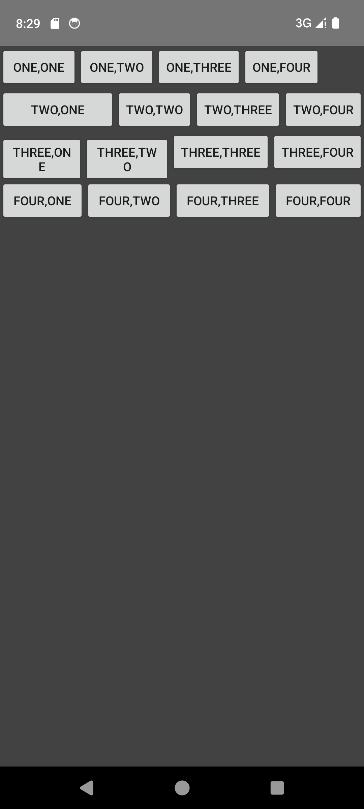
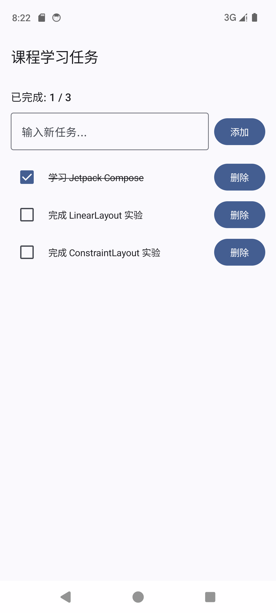
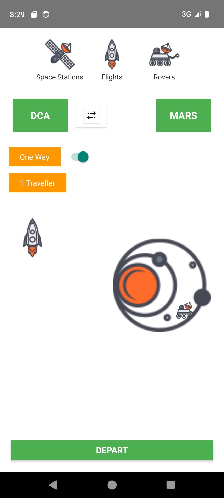
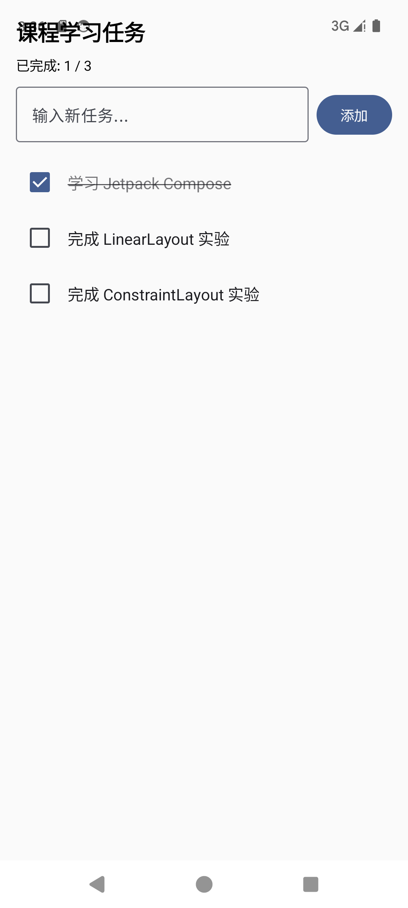

# 实验2 Android界面布局

## 一、实验目的

1. 掌握 Android 三种传统布局方式的使用：**LinearLayout（线性布局）**、**TableLayout（表格布局）**、**ConstraintLayout（约束布局）**
2. 掌握 Jetpack Compose 声明式 UI 的基本用法
3. 理解不同布局方式的特点、适用场景及约束写法

## 二、实验环境

| 项目 | 版本 |
|------|------|
| Android Studio | - |
| Gradle | 9.5.0 |
| AGP | 9.3.0 |
| Kotlin | 2.2.10 |
| compileSdk | 37 |
| minSdk | 24 |
| targetSdk | 37 |
| Compose BOM | 2026.02.01 |
| ConstraintLayout | 2.2.0 |
| 模拟器 | Pixel 7（Android 14 / API 34） |

## 三、实验内容

### 3.1 线性布局（LinearLayout）

#### 核心代码
```xml
<!-- activity_linear_layout.xml -->
<LinearLayout
    android:layout_width="match_parent"
    android:layout_height="wrap_content"
    android:orientation="horizontal">
    <Button
        android:layout_width="wrap_content"
        android:layout_height="wrap_content"
        android:layout_weight="1"
        android:text="Two,One" />
    <!-- ... -->
</LinearLayout>
```

#### 关键知识点
- `orientation="vertical"` / `"horizontal"`：控制子元素排列方向
- `layout_weight`：剩余空间按比例分配，**只有在横向 LinearLayout 中设置宽度为 0dp + weight 才能等比分配**
- 第 2、3 行用了 `layout_weight="1"`，第 1、4 行没用，演示不同权重效果

#### 运行截图


---

### 3.2 表格布局（TableLayout）

#### 核心代码
```xml
<!-- activity_table_layout.xml -->
<TableLayout
    android:layout_width="match_parent"
    android:layout_height="match_parent"
    android:stretchColumns="1"
    android:background="#424242">
    <TableRow>
        <TextView android:text="Open..." />
        <TextView android:text="Ctrl-O" android:gravity="right" />
    </TableRow>
    <View
        android:layout_height="2dip"
        android:background="#FF909090" />
    <!-- ... -->
</TableLayout>
```

#### 关键知识点
- `TableLayout` 是 `LinearLayout` 的子类，按行（`TableRow`）和列组织
- `stretchColumns="1"`：自动拉伸第 2 列填满剩余空间
- 列数由最多子元素的 `TableRow` 决定
- 用 `<View android:layout_height="2dip" />` 做分隔线
- 子元素用 `layout_column` 指定所在列

#### 运行截图


---

### 3.3 约束布局 - 计算器（ConstraintLayout 1）

#### 核心代码
```xml
<!-- activity_calculator.xml -->
<androidx.constraintlayout.widget.ConstraintLayout>
    <EditText
        android:id="@+id/display"
        android:layout_width="0dp"
        android:inputType="numberDecimal"
        app:layout_constraintEnd_toEndOf="parent"
        app:layout_constraintStart_toStartOf="parent" />

    <Button
        android:id="@+id/btnDiv"
        android:layout_width="0dp"
        android:layout_height="0dp"
        app:layout_constraintBottom_toTopOf="@id/btnMul"
        app:layout_constraintEnd_toEndOf="parent"
        app:layout_constraintTop_toBottomOf="@id/guideline" />
    <!-- ... -->
</androidx.constraintlayout.widget.ConstraintLayout>
```

```kotlin
// CalculatorActivity.kt - 四则运算逻辑
private fun calculate(a: Double, b: Double, op: String): Double {
    return when (op) {
        "+" -> a + b
        "-" -> a - b
        "×" -> a * b
        "÷" -> if (b == 0.0) Double.NaN else a / b
        else -> b
    }
}
```

#### 关键知识点
- 4×4 按钮网格：每列用 `Start_toEndOf="@id/上一个按钮"` + `End_toStartOf="@id/下一个按钮"` 形成约束链
- 每行第一个按钮 `Start_toStartOf="parent"`，最后一个 `End_toEndOf="parent"`
- `android:layout_width="0dp"` 配合两端约束 = match constraints（占满约束间距）
- `Guideline`：百分比定位辅助线，这里用于分隔顶部显示区和按钮区
- 计算器逻辑：状态机方式（firstOperand → operator → secondOperand → =），支持连续运算和除零保护

#### 运行截图


---

### 3.4 约束布局 - 太空旅行（ConstraintLayout 2）

#### 核心代码
```xml
<!-- activity_space_travel.xml -->
<androidx.constraintlayout.widget.ConstraintLayout>
    <!-- DCA 绿色框 -->
    <TextView
        android:id="@+id/dcaBox"
        android:layout_width="100dp"
        android:layout_height="60dp"
        app:layout_constraintStart_toStartOf="parent"
        app:layout_constraintTop_toBottomOf="@id/tabStationText" />

    <!-- 箭头自动居中 -->
    <LinearLayout
        android:id="@+id/arrowCenter"
        app:layout_constraintStart_toEndOf="@id/dcaBox"
        app:layout_constraintEnd_toStartOf="@id/marsBox" />

    <!-- MARS 绿色框 -->
    <TextView
        android:id="@+id/marsBox"
        app:layout_constraintEnd_toEndOf="parent" />
    <!-- ... -->
</androidx.constraintlayout.widget.ConstraintLayout>
```

#### 关键知识点
- **约束链自动居中**：`Start_toEndOf="A"` + `End_toStartOf="B"` → 元素自动在 A 和 B 之间居中
- **约束冲突解决**：避免多个水平约束导致位置不确定，优先用直接父子约束
- `FrameLayout` 嵌套：底层 `galaxy.png` + 顶层 `rover_icon.png` 实现轨道叠加效果
- 顶部 3 个 Tab 用 `HorizontalChain` 链式约束，等距分布
- 底部 `DEPART` 按钮 `0dp` 宽度 + 两端约束 = 全宽按钮

#### 运行截图


---

### 3.5 Jetpack Compose 任务列表

#### 核心代码
```kotlin
// TaskListActivity.kt
@Composable
fun TaskListScreen() {
    val tasks = remember {
        mutableStateListOf(
            Task(1, "学习 Jetpack Compose", completed = true),
            Task(2, "完成 LinearLayout 实验"),
            Task(3, "完成 ConstraintLayout 实验")
        )
    }

    LazyColumn(
        verticalArrangement = Arrangement.spacedBy(8.dp)
    ) {
        items(tasks) { task ->
            TaskItem(
                task = task,
                onCheckedChange = { checked ->
                    val index = tasks.indexOfFirst { it.id == task.id }
                    if (index >= 0) tasks[index] = tasks[index].copy(completed = checked)
                }
            )
        }
    }
}

@Composable
fun TaskItem(task: Task, ...) {
    Text(
        text = task.text,
        style = TextStyle(
            textDecoration = if (task.completed) TextDecoration.LineThrough else TextDecoration.None
        )
    )
}
```

#### 关键知识点
- **声明式 UI**：通过 `@Composable` 函数描述界面，状态变化自动刷新
- **状态管理**：`remember { mutableStateOf(...) }` / `remember { mutableStateListOf(...) }` 在重组间保持状态
- **重组（Recomposition）**：`completedCount` 从 `tasks.count { it.completed }` 派生，tasks 变化时自动重算
- **LazyColumn**：只渲染可见项的高效列表，替代传统 RecyclerView
- **条件样式**：`if (task.completed) TextDecoration.LineThrough` 动态切换删除线
- **Bottom-to-Down**：任务勾选后，计数和删除线同步变化

#### 运行截图


---

## 四、布局方式对比

| 特性 | LinearLayout | TableLayout | ConstraintLayout | Compose |
|------|-------------|-------------|------------------|---------|
| 约束表达 | orientation + weight | TableRow + column | 相对位置约束链 | 声明式调用链 |
| 嵌套 | 深嵌套笨重 | 深嵌套笨重 | 扁平，单一容器 | 灵活组合 |
| 响应式 | 差 | 差 | 好（百分比 bias） | 好（Modifier 组合） |
| 性能 | 好 | 好 | 好 | 好（跳过） |
| 学习曲线 | 低 | 低 | 中 | 中高 |
| 适用场景 | 简单单列/单行 | 表格类数据 | 复杂多元素界面 | 所有 UI（推荐） |

**结论**：ConstraintLayout 通过链式约束实现复杂布局，无需深嵌套，是 XML 时代的最佳选择；Jetpack Compose 是 Android UI 的未来方向，以声明式方式和 Kotlin 强大组合能力，正在取代传统 XML 布局。

## 五、踩坑记录

### 坑 1：ConstraintLayout bias 导致位置错乱
`layout_constraintHorizontal_bias` 同时配合两端约束时，bias 值会**同时影响** Start 和 End 约束。应去掉 bias，改用直接约束：
```xml
<!-- ❌ 错误 -->
app:layout_constraintStart_toStartOf="parent"
app:layout_constraintEnd_toEndOf="parent"
app:layout_constraintHorizontal_bias="0.3"

<!-- ✅ 正确 -->
app:layout_constraintStart_toStartOf="parent"
app:layout_constraintEnd_toStartOf="@id/arrowCenter"
```

### 坑 2：Kotlin dp 单位缺小数点
```kotlin
// ❌ 编译错误：Expression 'dp' of type 'Dp' cannot be invoked as a function
.padding(24dp)

// ✅ 正确
.padding(24.dp)
```

### 坑 3：国内网络访问 dl.google.com 超时
Android SDK 组件下载和 Gradle 依赖解析失败，**解决方法**：

1. `settings.gradle.kts` 添加阿里云镜像：
```kotlin
maven { url = uri("https://maven.aliyun.com/repository/google") }
maven { url = uri("https://maven.aliyun.com/repository/public") }
```

2. Android Studio SDK Manager → SDK Update Sites → 添加：
```
https://mirrors.cloud.tencent.com/AndroidSDK/
```

### 坑 4：Calculator Layout 最后一行约束丢失
4×4 网格的最后一行（.、0、=、+）缺少 `Bottom_toBottomOf="parent"` 约束，导致按钮不贴底。**必须**确保每行有完整的 Top 和 Bottom 约束。

### 坑 5：ConstraintLayout Activity 必须手动注册到 Manifest
新建 Activity 后必须在 `AndroidManifest.xml` 的 `<application>` 标签内注册 `<activity>`，否则启动报 `ActivityNotFoundException`。

## 六、项目结构

```
app/src/main/
├── AndroidManifest.xml          # 注册所有 Activity
├── java/com/example/test/
│   ├── MainActivity.kt           # 导航菜单（Compose）
│   ├── LinearLayoutActivity.kt   # 实验1：线性布局
│   ├── TableLayoutActivity.kt    # 实验2：表格布局
│   ├── CalculatorActivity.kt     # 实验3：计算器（ConstraintLayout）
│   ├── SpaceTravelActivity.kt    # 实验4：太空旅行（ConstraintLayout）
│   ├── TaskListActivity.kt       # 实验5：任务列表（Compose）
│   └── ui/theme/Theme.kt         # Compose 主题
└── res/
    ├── layout/                   # XML 布局文件
    │   ├── activity_linear_layout.xml
    │   ├── activity_table_layout.xml
    │   ├── activity_calculator.xml
    │   └── activity_space_travel.xml
    └── drawable/                 # 太空图片资源
        ├── galaxy.png
        ├── rocket_icon.png
        ├── rover_icon.png
        ├── space_station_icon.png
        ├── single_arrow.png
        └── double_arrows.png
```

## 七、运行方式

### Android Studio（推荐）
1. 打开项目 `d:\CodeTools\AndroidProject\1`
2. 等待 Gradle Sync 完成
3. 选择模拟器或真机，点击 ▶️ Run

### 命令行
```powershell
# 安装到已连接设备
gradlew.bat installDebug

# 启动主界面
adb shell am start -n com.example.test/.MainActivity
```

### GitHub
仓库地址：https://github.com/mykonastra/Test

## 八、实验总结

1. **LinearLayout** 适合简单线性排列，`layout_weight` 是核心特性
2. **TableLayout** 是 LinearLayout 的特例，`stretchColumns` + `TableRow` 实现等宽列
3. **ConstraintLayout** 是 XML 布局的终极形态，链式约束（Start_toEndOf + End_toStartOf）实现自动居中，避免 bias 干扰
4. **Jetpack Compose** 以声明式函数组合 UI，`remember` 管理状态，`LazyColumn` 高效列表，是 Android UI 的未来方向
5. 实际工程中**优先使用 Compose**，XML 布局仅用于兼容旧代码或纯布局演示
